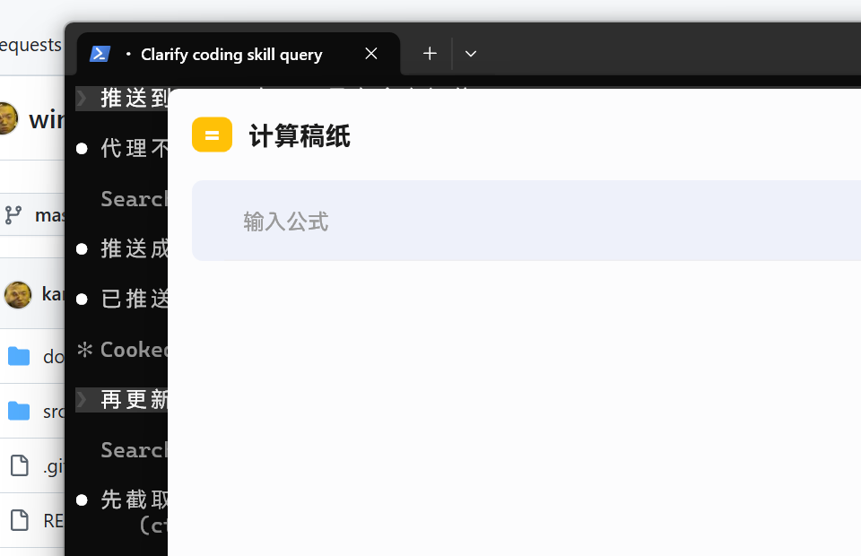

# 计算稿纸

Win11 风格 WPF 桌面计算器。逐行输入公式，保留计算过程，右侧实时显示结果。



## 运行

直接启动 `src\ManuscriptCalculator\bin\Release\ManuscriptCalculator.exe`，或构建：

```powershell
& "C:\Windows\Microsoft.NET\Framework64\v4.0.30319\MSBuild.exe" src\ManuscriptCalculator\ManuscriptCalculator.csproj /p:Configuration=Release
```

## 操作

| 操作 | 快捷键 |
|------|--------|
| 下一行 | `Enter` |
| 切换行 | `↑` `↓` |
| 空行删除 | `Backspace` |
| 复制当前行结果 | `Ctrl+C` 或单击右侧结果 |
| 清空全部 | `Ctrl+R` |
| 收起窗口 | `Esc` |
| 呼出窗口 | 双击 `Alt` |

托盘右键可设置开机自启、退出。

## 表达式

四则运算、括号、百分比、幂、常量（`pi` `e`）、函数（`sqrt` `abs` `sin` `cos` `tan` `log` `ln` `round` `floor` `ceil` `min` `max` `pow`）
